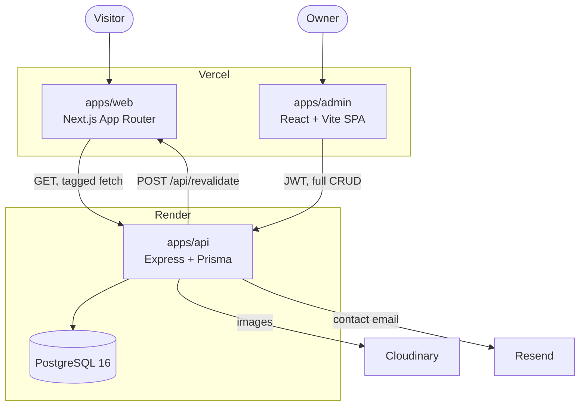
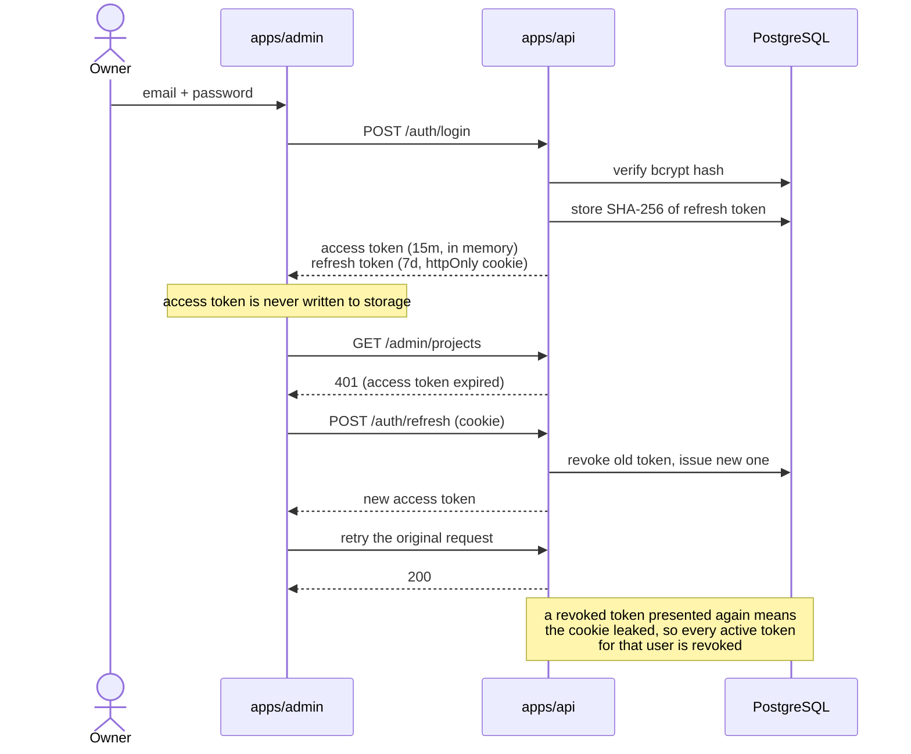
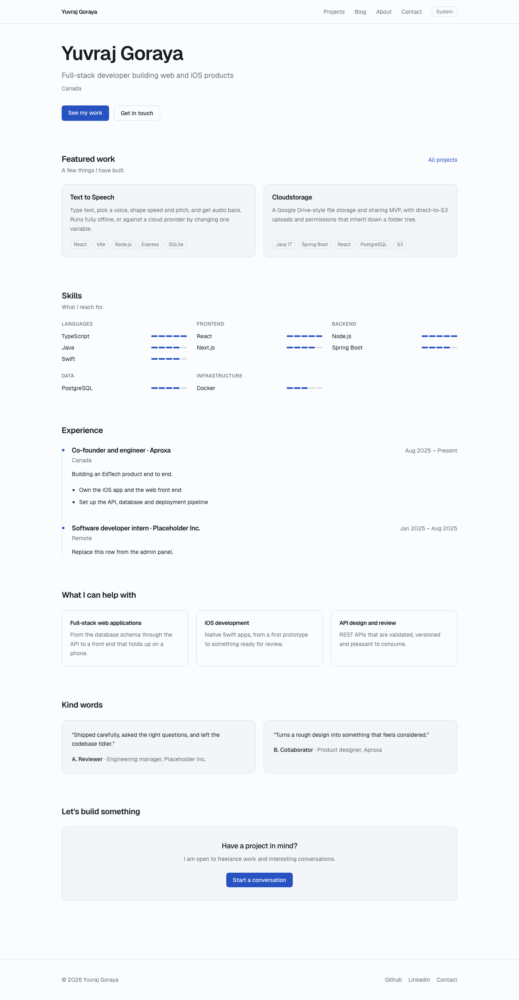
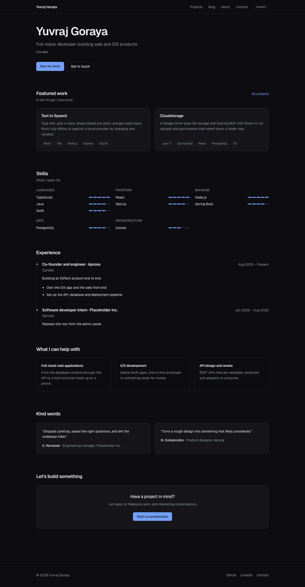
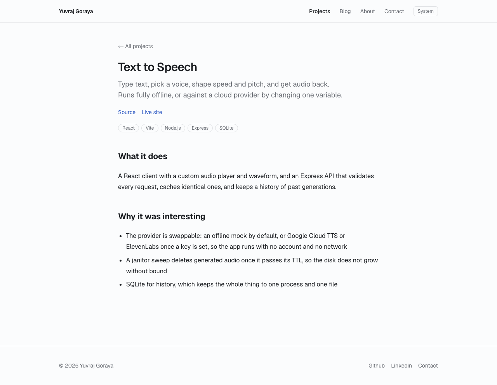
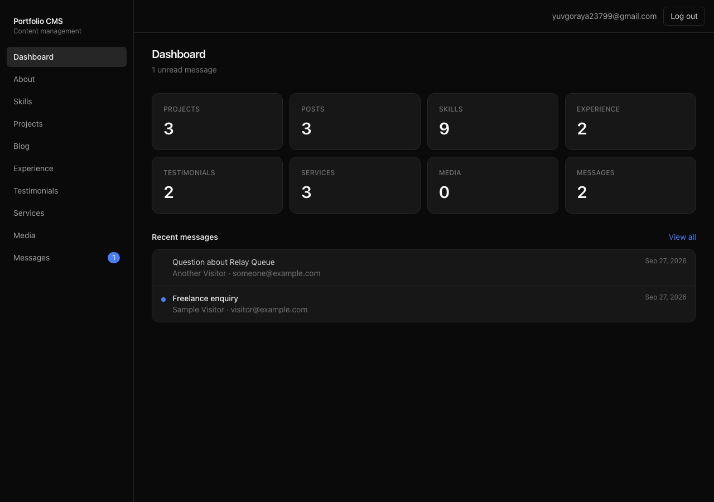
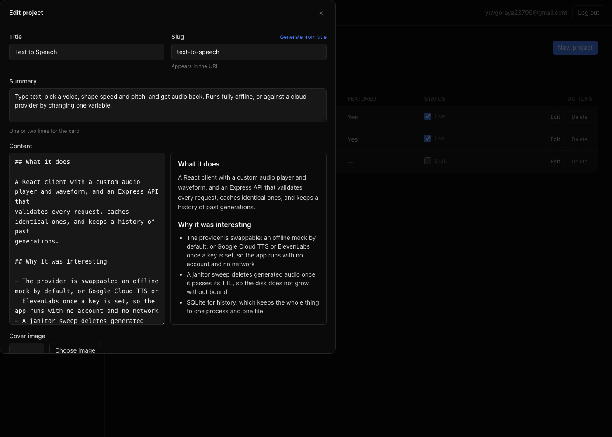

# Portfolio with a custom CMS

A personal portfolio whose content is managed by a CMS built from scratch — no Strapi, no Sanity, no Contentful. A Node API owns the data, a React admin panel edits it, and a Next.js site renders it and updates within a second of a save, without a rebuild.

[](https://github.com/Yuv1008/portfolio/actions/workflows/ci.yml)


**Live site** · _add your URL_  **Admin** · _add your URL_

---

## Why a custom CMS

A headless CMS would have been faster to stand up, and for a content team it would be the right answer. This repository exists to show the parts a hosted CMS hides: schema design, auth with rotating refresh tokens, a generic CRUD layer, cache invalidation across service boundaries, and the deployment story for all of it.

The tradeoff is real. There is no editorial workflow, no roles, no audit log, and one admin account. What there is instead is about 9,000 lines of TypeScript where every decision is visible and testable.

---

## Architecture



`packages/shared` sits outside that picture: it holds the zod schemas and inferred types, and all three apps import it. The API validates requests with them, the admin renders its forms from them, and the site parses API responses against them — so a shape can only drift in one place.

Every read the site makes is tagged with its resource name. After any admin write the API posts that tag to the site, which drops exactly those cached pages — so editing one project does not invalidate the blog.

The auth flow is the other piece worth seeing in full:



---

## Stack

| Layer | Choice | Why |
| --- | --- | --- |
| Monorepo | pnpm workspaces | One `zod` schema package imported by all three apps, with no publish step |
| API | Express 4 + TypeScript | Small surface, explicit middleware order |
| Database | PostgreSQL 16 + Prisma | Typed queries and a migration history |
| Validation | zod | The same schema validates the request, drives the admin form and parses the response |
| Admin | React 19, Vite, TanStack Query | One table and one form render every content type |
| Site | Next.js 16 App Router | Server components and tagged caching give static speed with live content |
| Styling | Tailwind 4 | CSS-first tokens, so dark mode is a variable swap |
| Media | Cloudinary | The database stores a URL; images are resized at the CDN |
| Email | Resend | Contact notifications |
| Tests | Vitest + Supertest | 61 tests over the HTTP surface, not the internals |

---

## Getting started

**Prerequisites:** Node 20.11+, Docker, and pnpm (`corepack enable && corepack prepare pnpm@10.15.0 --activate`).

1. **Clone and install.**

   ```bash
   git clone <this repo> portfolio && cd portfolio
   pnpm install
   ```

   Install also generates the Prisma Client. Without it nothing that imports `@prisma/client` compiles.

2. **Create the env files.**

   ```bash
   cp apps/api/.env.example apps/api/.env
   cp apps/admin/.env.example apps/admin/.env
   cp apps/web/.env.example apps/web/.env.local
   ```

   Then edit `apps/api/.env`: set `JWT_SECRET` to at least 32 characters (`openssl rand -base64 48`), and set `ADMIN_EMAIL` and `ADMIN_PASSWORD` to whatever you want to log in with. The API refuses to start if any required variable is missing, and tells you which.

3. **Start Postgres.**

   ```bash
   pnpm db:up
   ```

   Postgres 16 in Docker on port **5434**, chosen to stay clear of a local install on 5432.

4. **Migrate and seed.**

   ```bash
   pnpm migrate
   pnpm seed
   ```

   The seed creates your admin user plus sample content for every model, including one unpublished project and one draft post so the published-only filtering is visible. It is idempotent.

5. **Run everything.**

   ```bash
   pnpm dev
   ```

   | | |
   | --- | --- |
   | Site | http://localhost:3010 |
   | Admin | http://localhost:5180 |
   | API | http://localhost:4000 |

   Those ports are deliberate: 3000 and 5173 collide with too much else.

6. **Log in** at http://localhost:5180 with the credentials from step 2, change a project, and watch the site change.

### Optional services

Uploads and contact email need accounts. Without them the API still runs: an upload returns `503` naming the variables to set, and a contact submission is saved and reports `emailed: false`.

- **Cloudinary** — set `CLOUDINARY_CLOUD_NAME`, `CLOUDINARY_API_KEY`, `CLOUDINARY_API_SECRET`.
- **Resend** — set `RESEND_API_KEY` and `OWNER_EMAIL`. Until you verify a sending domain, Resend only delivers to your own account address, so start with that one.

---

## Environment variables

### `apps/api/.env`

| Variable | Required | Purpose |
| --- | --- | --- |
| `DATABASE_URL` | yes | Postgres connection string |
| `ADMIN_URL` | yes | Admin origin. CORS allows this and `WEB_URL`, nothing else |
| `WEB_URL` | yes | Site origin, and where revalidation requests are sent |
| `JWT_SECRET` | yes | Signs access tokens. 32 characters minimum |
| `ADMIN_EMAIL` | yes | Seeded admin account |
| `ADMIN_PASSWORD` | yes | Seeded admin password |
| `NODE_ENV` | no | `development` by default |
| `PORT` | no | `4000` |
| `ACCESS_TOKEN_TTL` | no | `15m`. Validated as a duration at boot |
| `REFRESH_TOKEN_TTL_DAYS` | no | `7` |
| `COOKIE_SAMESITE` | no | `lax` locally; `none` in production, where the admin is on another domain |
| `LOG_LEVEL` | no | `info` |
| `CLOUDINARY_CLOUD_NAME` | no | Uploads return 503 without the three Cloudinary values |
| `CLOUDINARY_API_KEY` | no | |
| `CLOUDINARY_API_SECRET` | no | |
| `RESEND_API_KEY` | no | Contact mail is skipped without it; the message is still saved |
| `RESEND_FROM` | no | `Portfolio <onboarding@resend.dev>` |
| `OWNER_EMAIL` | no | Where contact notifications go |
| `REVALIDATE_SECRET` | no | Must match the site's value, or revalidation is skipped |

### `apps/admin/.env`

| Variable | Required | Purpose |
| --- | --- | --- |
| `VITE_API_URL` | yes | API base URL. Inlined into the bundle, so never a secret |

### `apps/web/.env.local`

| Variable | Required | Purpose |
| --- | --- | --- |
| `API_URL` | yes | Server-side only: where the Next server reads content from |
| `NEXT_PUBLIC_API_URL` | yes | The contact form posts from the browser |
| `NEXT_PUBLIC_SITE_URL` | yes | Canonical URLs, Open Graph and the sitemap |
| `REVALIDATE_SECRET` | yes | Must match the API's value |

---

## API

Public routes need no auth. Admin routes require `Authorization: Bearer <access token>`.

`:resource` is one of `skills`, `projects`, `blogs`, `experience`, `testimonials`, `services` — all six are served by one router factory.

### Auth

| Method | Path | Auth | Purpose |
| --- | --- | --- | --- |
| `POST` | `/auth/login` | — | Access token in the body, refresh token in an httpOnly cookie. 5 attempts per 15 min per IP |
| `POST` | `/auth/refresh` | cookie | Rotates the refresh token and revokes the old one |
| `POST` | `/auth/logout` | cookie | Revokes the token and clears the cookie |
| `GET` | `/auth/me` | bearer | The signed-in admin |

### Content

| Method | Path | Auth | Purpose |
| --- | --- | --- | --- |
| `GET` | `/:resource` | — | Published rows only, sorted. `?page`, `?limit`, `?q` |
| `GET` | `/:resource/:idOrSlug` | — | One row. Unpublished is indistinguishable from missing |
| `GET` | `/about` | — | The About singleton |
| `PUT` | `/about` | bearer | Creates or updates it |
| `GET` | `/admin/:resource` | bearer | Includes drafts. `?published=true\|false\|all` |
| `GET` | `/admin/:resource/:id` | bearer | One row, published or not |
| `POST` | `/admin/:resource` | bearer | Create. Duplicate slug returns 409 |
| `PUT` | `/admin/:resource/:id` | bearer | Replace |
| `PATCH` | `/admin/:resource/:id` | bearer | Partial update |
| `PATCH` | `/admin/:resource/reorder` | bearer | `{ items: [{ id, order }] }`, applied in one transaction |
| `DELETE` | `/admin/:resource/:id` | bearer | Delete |

Blogs paginate and sort newest first; they have no `order` column. Skills, experience and services have no `published` column, so their public lists return every row. Reorder exists for every resource except blogs.

### Media, contact and the rest

| Method | Path | Auth | Purpose |
| --- | --- | --- | --- |
| `POST` | `/admin/upload` | bearer | One image to Cloudinary. Images only, 5 MB cap |
| `GET` | `/admin/media` | bearer | Paginated, newest first |
| `DELETE` | `/admin/media/:id` | bearer | Removes the Cloudinary asset, then the row |
| `POST` | `/contact` | — | Validated, honeypot, 3 per hour per IP |
| `GET` | `/admin/messages` | bearer | `?page`, `?limit`, `?q` across name, email, subject, body |
| `GET` | `/admin/messages/unread-count` | bearer | For the dashboard badge |
| `PATCH` | `/admin/messages/:id/read` | bearer | `{ read: boolean }` |
| `DELETE` | `/admin/messages/:id` | bearer | Delete |
| `GET` | `/admin/stats` | bearer | Every dashboard count in one request |
| `GET` | `/health` | — | `200` with `db: "up"`, `503` when the database is unreachable |

---

## Project structure

```
portfolio/
├─ packages/shared/        zod schemas and inferred types, imported by all three apps
├─ apps/api/
│  ├─ prisma/              schema, migrations, seed
│  └─ src/
│     ├─ lib/crudFactory   one router factory serving six resources
│     ├─ middleware/       auth, validation, rate limits, uploads, errors
│     ├─ routes/           health, auth, about, content, media, contact, stats
│     └─ tests/            61 Supertest cases
├─ apps/admin/src/
│  ├─ lib/resources.ts     the registry: one entry per content type
│  └─ components/          ResourceTable, ResourceForm, field types, image picker
└─ apps/web/src/
   ├─ lib/api.ts           typed client, tagged fetches
   └─ app/                 home, about, projects, blog, contact, sitemap, OG images
```

Adding a seventh content type means a schema file in `packages/shared`, an entry in `apps/api/src/routes/content.ts`, and an entry in `apps/admin/src/lib/resources.ts`. No new controller, service, route or page.

---

## Screenshots

All captured from the running app against seeded content.

### The site

| Light | Dark |
| --- | --- |
|  |  |



### The admin panel





---

## Testing

```bash
pnpm test          # 61 Supertest cases against the API
pnpm lint
pnpm typecheck
pnpm build         # all four workspaces
```

Tests run against a separate `portfolio_test` database that the suite creates and migrates itself. It refuses to run unless the database name contains `test`, because it truncates every table between cases.

The web build reads the API to prerender pages, so the API must be running for `pnpm build`.

## Deployment

| Part | Host | Config |
| --- | --- | --- |
| API + Postgres | Render | `render.yaml`, built from `apps/api/Dockerfile` |
| Site | Vercel | `apps/web/vercel.json`, root directory `apps/web` |
| Admin | Vercel | `apps/admin/vercel.json`, root directory `apps/admin` |

Deploy the API first: the site reads from it at build time. Set `COOKIE_SAMESITE=none` in production, since the admin and API are on different domains, and give the API and the site the same `REVALIDATE_SECRET`.

The container runs `prisma migrate deploy` on boot, so a deploy cannot serve against an older schema.

## Licence

[MIT](LICENSE).
